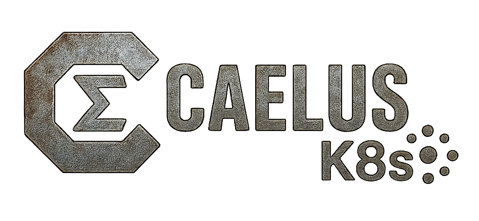

# Caelus K8s

A distributed polyphonic synthesizer designed to run in a Kubernetes environment.
"If Brian Eno and Kelsey Hightower had a baby synth, it’d be Caelus K8s."



## Overview

Caelus K8s separates MIDI control and audio generation across a controller and multiple worker nodes, with each worker generating one note at a time. The system uses Open Sound Control (OSC) for sending control messages and Real-time Transport Protocol (RTP) for returning audio streams.

## Features

- Controller receives MIDI input and routes notes to workers via OSC
- Workers generate sine waves based on note commands and stream audio back via RTP
- Controller mixes and plays audio from all workers
- Multi-node support for polyphony
- Kubernetes deployment ready

## Installation

### Local Development

1. Create a virtual environment:
   ```
   python -m venv caelus-venv
   ```

2. Activate the virtual environment:
   ```
   source caelus-venv/bin/activate
   ```

3. Install dependencies:
   ```
   pip install python-osc pyo mido python-rtmidi numpy
   ```

### Kubernetes Deployment

For Kubernetes deployment, see the [Kubernetes README](kubernetes/README.md).

## Usage

First, activate the virtual environment:
```
source venv/bin/activate
```

### Start the Controller

```
./caelus controller
```

The controller:
- Uses JACK audio with client name "controller"
- Prompts for MIDI input device selection
- Listens for workers to register

### Start Workers

Workers can run either on the same machine as the controller or on different physical servers.

**On the same machine:**

Start the first worker:
```
./caelus worker
```

Start additional workers (use different ports and client names):
```
./caelus worker --port 9001 --jack-client-name worker2
./caelus worker --port 9002 --jack-client-name worker3
```

**On different physical servers:**

For distributed audio, workers should still have JACK installed and running, which provides professional networked audio via NetJack:

```
./caelus worker --controller-ip <controller-ip-address> --port 9000 --jack-client-name worker1
```

**Important Note:** For proper audio routing between machines, both controller and workers should have JACK installed. Workers use NetJack to stream audio to the controller's JACK server. We recommend installing JACK on all machines in the network.

**Network-only mode (experimental):**

For testing purposes only, you can run a worker in network-only mode, but note that audio streaming is not yet fully implemented in this mode:

```
./caelus worker --network-only
```

Each worker:
- Registers with the controller
- Generates audio for notes assigned by the controller
- Adaptively uses JACK if available or network-only mode if not

### Additional Options

#### Test Notes

Send test notes through the controller:
```
./caelus controller --test
```

#### Run Without Audio Output

Run in offline mode (disable audio):
```
./caelus controller --offline
```

#### Disable MIDI Selection

Skip the MIDI device selection prompt:
```
./caelus controller --no-select-midi
```

#### Disable JACK Audio

Use socket mode instead of JACK:
```
./caelus controller --no-jack
```

## Architecture

- **Controller**: Receives MIDI, sends OSC, receives RTP, mixes audio
- **Worker**: Receives OSC, generates audio, sends RTP

## Distributed Audio Setup with JACK

For distributed audio across multiple machines, JACK needs to be properly configured:

### NetJack Setup

1. **On the controller machine**, start the JACK server:
   ```
   jackd -d alsa -r 48000
   ```

2. **On each worker machine**, start JACK with NetJack driver pointing to the controller:
   ```
   jackd -d net -a CONTROLLER_IP_ADDRESS
   ```

3. Run the Caelus controller and workers:
   ```
   # On controller machine
   ./caelus controller
   
   # On each worker machine
   ./caelus worker --controller-ip CONTROLLER_IP_ADDRESS --jack-client-name workerN
   ```

When using this setup, the workers will automatically connect their audio outputs to the controller's inputs via NetJack.

### Communication Flow

1. Controller receives MIDI note
2. Controller selects available worker
3. Controller sends OSC message (note, velocity, etc.) to worker
4. Worker synthesizes PCM sine wave
5. Worker sends RTP stream with audio
6. Controller receives, mixes, and plays back audio

## Future Plans

- Advanced synthesizer capabilities (FM, filters, etc.)
- Web-based patch editor
- Dynamic worker allocation
- Multiple synth voices per worker

## License

All Rights Reserved

This project and its code are provided for non-commercial use only. No permission is granted for commercial use, distribution, or modification without explicit written authorization.
