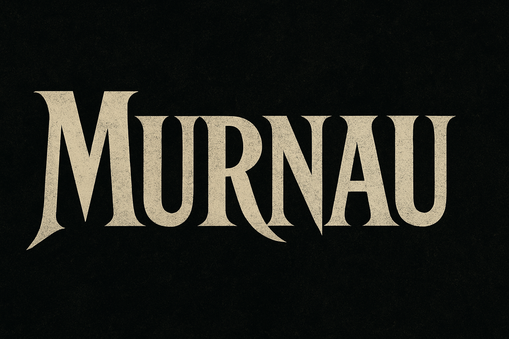

# Murnau - Cinematic Synthesizer

A stylish, expressive synthesizer inspired by German Expressionist cinema aesthetics, created with Faust DSP language and controlled through OSC or MIDI.



## Overview

Murnau is a German Expressionist-inspired synthesizer system that combines:

- Faust DSP for high-quality, efficient audio processing
- OSC for flexible parameter control
- MIDI for playing notes and controller integration
- PyQt6 for a stylish, cinematic user interface

## Components

The system consists of the following core components:

1. **Synthesizer Engine**: Created with Faust DSP language (`legato_synth.dsp`)
   - Monophonic synthesizer with legato capability
   - Four waveform types: Sine, Triangle, Sawtooth, Square
   - Full ADSR envelope control
   - Expressive playing controls

2. **MIDI Control Bridge**: Translates MIDI to OSC commands (`best_midi.py`)
   - Handles legato note transitions
   - Maps MIDI CC controllers to synth parameters
   - Optimized for expressive playing

3. **User Interface**: A stylish PyQt6 UI inspired by German Expressionism (`murnau_ui.py`)
   - Direct control of all synthesizer parameters
   - Built-in virtual piano keyboard
   - Integrated MIDI device connection
   - Waveform visualization
   - German Expressionist-inspired design

## Usage

1. Start the Faust synthesizer with:
   ```
   faust2jack legato_synth.dsp
   ./legato_synth
   ```

2. Launch the UI:
   ```
   python murnau_ui.py [synth_name] [osc_port]
   ```
   - Default synth_name: "legato_synth"
   - Default osc_port: 5510

3. Control with MIDI:
   - Connect a MIDI controller using the UI
   - Or use the standalone MIDI bridge:
   ```
   python best_midi.py [synth_name]
   ```

## MIDI Controller Mappings

- CC1 (Mod wheel): Waveform selection
- CC7: Main volume/gain
- CC73: Attack time
- CC75: Decay time
- CC31: Sustain level
- CC72: Release time

## UI Keyboard Shortcuts

- Z-M keys: Play notes (Z = C4, S = C#4, etc.)
- Mouse: Click piano keys to play notes

## Requirements

- Python 3.6+
- PyQt6
- Mido (MIDI library)
- Faust compiler (for building the synth)
- JACK audio system

## Acknowledgments

Inspired by the films of F.W. Murnau and the German Expressionist movement.

## License

MIT License